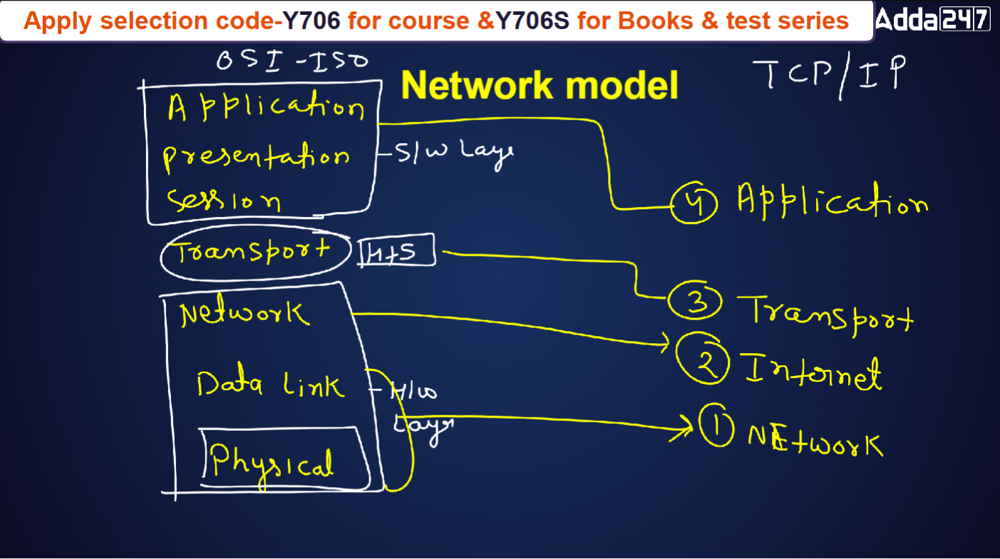

Here’s a more detailed and structured version of your notes:  

---

# **Data Communication and Networking**  

### **Communication**  
- The exchange of information between two or more entities using a medium.  

### **Network**  
- A collection of interconnected nodes (computers, devices, or servers) that share and exchange data.  

---

## **Types of Signals**  
1. **Analog Signal** – Continuous wave signals that vary over time (e.g., sound waves, AM/FM radio signals).  
2. **Digital Signal** – Discrete signals represented by binary values (0s and 1s), used in computers and modern communication systems.  

---

## **Modem (Modulator-Demodulator)**  
A device that enables communication between digital and analog systems by converting signals.  

### **Signal Conversion:**  
- **Modulation:** Converting a digital signal into an analog signal (used for transmission over analog mediums like telephone lines).  
- **Demodulation:** Converting an analog signal back into a digital signal (used for decoding at the receiver’s end).  

---

## **Signal Degradation Factors**  

### **1. Attenuation (Signal Loss)**  
- **Definition:** A decrease in signal strength as it propagates through a medium.  
- **Causes:** Resistance in cables, absorption in the medium, longer distances.  
- **Solutions:** Use **amplifiers (analog signals)** or **repeaters (digital signals)** to boost signal strength.  

### **2. Dispersion (Signal Spread and Overlapping)**  
- **Definition:** As a signal travels through a medium, it tends to spread and overlap with adjacent signals.  
- **Impact:** Leads to signal distortion and data corruption, particularly in high-speed networks.  
- **Types:**  
  - **Modal Dispersion** – Occurs in multimode optical fibers due to different light paths.  
  - **Chromatic Dispersion** – Caused by different wavelengths of light traveling at different speeds in fiber optics.  
  - **Inter-Symbol Interference (ISI)** – Digital signals interfere with each other due to dispersion.  
- **Solution:** Use **single-mode optical fiber** and **monochromatic light sources (lasers).**  

### **3. Noise (Unwanted Disturbances in Signals)**  
- **Definition:** Random disturbances or fluctuations in an analog or digital signal that distort actual information.  
- **Types of Noise:**  
  - **Thermal Noise** – Caused by random motion of electrons in electronic circuits.  
  - **Intermodulation Noise** – Occurs when different frequencies mix and interfere.  
  - **Crosstalk** – When signals from adjacent channels interfere with each other.  
  - **Impulse Noise** – Sudden spikes caused by power surges, lightning, or switching circuits.  
- **Solutions:** Use **shielded cables, error correction techniques, and noise reduction filters.**  

---

## **Transmission Mediums**  

### **1. Wired Media**  
- **Twisted Pair Cable** – Two copper wires twisted together, used in telephone lines and LANs.  
- **Coaxial Cable** – Single copper conductor with shielding, used in cable TV and broadband.  
- **Optical Fiber** – Uses light signals for high-speed and long-distance transmission with minimal interference.  

### **2. Wireless Media**  
- **Infrared** – Short-range communication (e.g., remote controls).  
- **Radio Waves** – Used in Wi-Fi, Bluetooth, and AM/FM radio.  
- **Microwave** – Used for long-distance communication, satellite links.  
- **Satellite Communication** – Global communication using satellites for GPS, broadcasting, and internet access.  

---

## **Switching in Networking**  

### **Definition:**  
- **Switching is a mechanism that directs data from the source to the destination across a network, even if they are not directly connected.**  
- **It helps in optimizing network efficiency by choosing the best path for data transmission.**  

### **Types of Switching**  

#### **1. Circuit Switching**  
- A dedicated communication path is established between the sender and receiver for the entire duration of the conversation.  
- **Example:** Traditional telephone systems.  
- **Advantages:**  
  - Provides a constant and reliable connection.  
  - Low latency since the path remains reserved.  
- **Disadvantages:**  
  - Wastes resources when no data is being transmitted.  
  - Not suitable for bursty data traffic like the internet.  

#### **2. Packet Switching**  
- Data is broken into **packets**,each packet contain a destination address and each taking the best available route independently to reach the destination.  
- **Example:** The Internet, email, VoIP.  
- **Advantages:**  
  - Efficient use of network resources.  
  - No dedicated path needed, allowing multiple users to share the network.  
  - Reliable and faster for data transmission.  
- **Disadvantages:**  
  - Packets may take different paths and arrive out of order, requiring reassembly.  
  - More complex protocols are needed to handle lost or delayed packets.  

#### **3. Message Switching**  
- The entire message is sent to intermediate nodes before reaching the final destination, where it is **stored and forwarded**.  
- **Example:** Email, SMS messaging.  
- **Advantages:**  
  - Does not require a dedicated circuit.  
  - Efficient for storing and forwarding large messages.  
- **Disadvantages:**  
  - Higher delays as messages are stored before being forwarded.  
  - Requires large storage capacity at intermediate nodes.  

---

### **Comparison of Switching Techniques**  

| Switching Type | Connection Type | Suitable for | Speed | Efficiency |
|---------------|----------------|--------------|--------|-----------|
| Circuit Switching | Dedicated path | Voice calls, real-time communication | High | Low (wastes bandwidth when idle) |
| Packet Switching | No fixed path | Internet, data transfer | High | High |
| Message Switching | Store-and-forward | Email, SMS | Low | Moderate |

---

This improved version adds better structure, more explanations, real-world examples, and a comparison table. Let me know if you need further modifications! 🚀

## **Network Model and Its Types**  

A **network model** defines how data is transmitted, processed, and managed in a computer network. It provides a structured approach to networking by dividing communication into layers, each with a specific function.  

There are **two primary network models**:  
1. **OSI Model (Open Systems Interconnection Model)**  
2. **TCP/IP Model (Transmission Control Protocol/Internet Protocol Model)**  

---

## **1. OSI Model (Open Systems Interconnection Model)**  
The OSI model is a **theoretical model** developed by the **International Organization for Standardization (ISO)** to standardize network communication. It consists of **seven layers**, each handling specific tasks.  

### **OSI Model Layers:**
| **Layer** | **Function** | **Example Protocols/Technologies** |
|-----------|-------------|-----------------------------------|
| **7. Application Layer** | Provides user interface and network services | HTTP, FTP, SMTP, DNS |
| **6. Presentation Layer** | Ensures data formatting, encryption, and compression | SSL, TLS, JPEG, MP3 |
| **5. Session Layer** | Establishes, maintains, and terminates sessions | NetBIOS, RPC |
| **4. Transport Layer** | Handles data flow control, error detection, and retransmission | TCP, UDP |
| **3. Network Layer** | Manages logical addressing (IP addressing) and routing | IP, ICMP, ARP |
| **2. Data Link Layer** | Responsible for error detection and framing | Ethernet, MAC, PPP |
| **1. Physical Layer** | Transmits raw bits over the communication medium | Cables, Hubs, Wi-Fi |

### **Advantages of the OSI Model:**  
✅ Provides a **clear modular structure** for understanding networking.  
✅ Ensures **interoperability** between different network hardware and software.  
✅ Helps in **troubleshooting network issues** efficiently.  

### **Disadvantages of the OSI Model:**  
❌ More **complex** compared to real-world implementations.  
❌ **Not widely used** in practical networking (TCP/IP is more dominant).  

---

## **2. TCP/IP Model (Transmission Control Protocol/Internet Protocol Model)**  
The **TCP/IP model** is a **practical and widely used network model** that forms the backbone of the Internet. It is simpler than the OSI model and consists of **four layers**.  

### **TCP/IP Model Layers:**
| **Layer** | **Equivalent OSI Layer(s)** | **Function** | **Example Protocols** |
|-----------|----------------------|-------------|-------------------|
| **4. Application Layer** | OSI Layers 7, 6, 5 | Handles user applications and services | HTTP, FTP, SMTP, DNS |
| **3. Transport Layer** | OSI Layer 4 | Ensures reliable data transfer and error correction | TCP, UDP |
| **2. Internet Layer** | OSI Layer 3 | Handles IP addressing and routing | IP, ICMP, ARP |
| **1. Network Access Layer** | OSI Layers 2, 1 | Deals with physical transmission of data | Ethernet, Wi-Fi, PPP |

### **Advantages of the TCP/IP Model:**  
✅ **Widely used** for Internet and networking.  
✅ **Simpler and more practical** compared to the OSI model.  
✅ Supports **cross-platform communication** between different networks.  

### **Disadvantages of the TCP/IP Model:**  
❌ **Less modular** than OSI; layers are not strictly separated.  
❌ **Difficult to replace protocols** due to interdependence.  

---

## **Comparison: OSI vs. TCP/IP Model**  

| **Feature** | **OSI Model** | **TCP/IP Model** |
|------------|-------------|----------------|
| **Number of Layers** | 7 | 4 |
| **Developed By** | ISO | U.S. Department of Defense (DoD) |
| **Usage** | Theoretical and educational | Practical and widely used |
| **Protocol Dependency** | Protocol-independent | Protocol-dependent (IP-based) |
| **Flexibility** | More modular | Less modular |

---

### **Conclusion:**  
- The **OSI Model** is useful for understanding **theoretical networking concepts** and troubleshooting.  
- The **TCP/IP Model** is the **practical model** used in real-world networking and forms the basis of the **Internet.**  

Would you like me to add more details or examples? 🚀